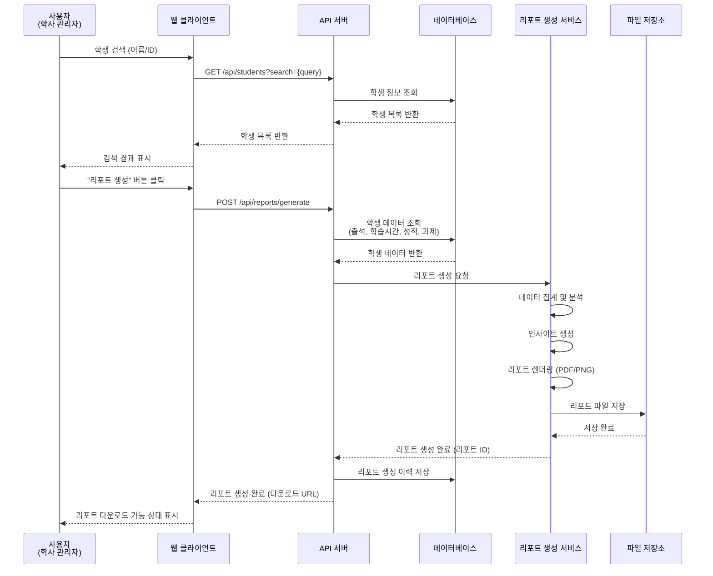
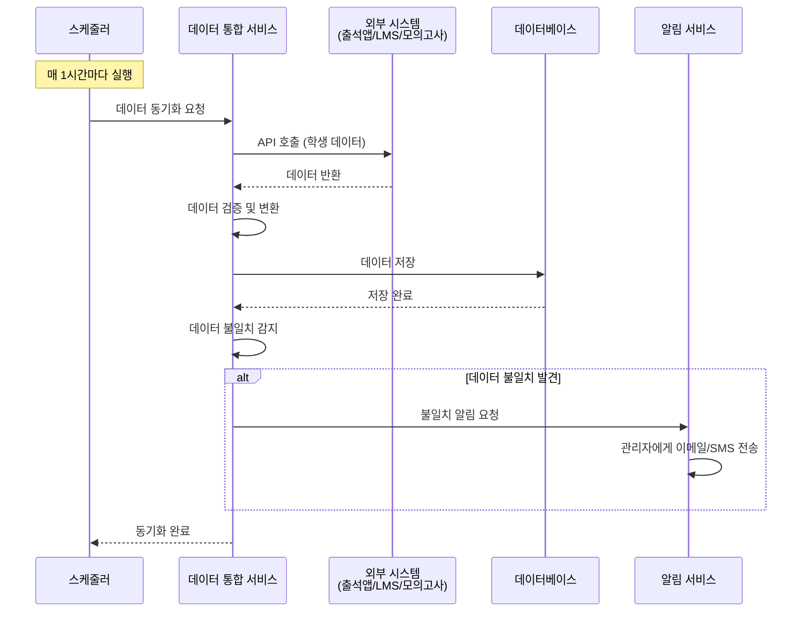
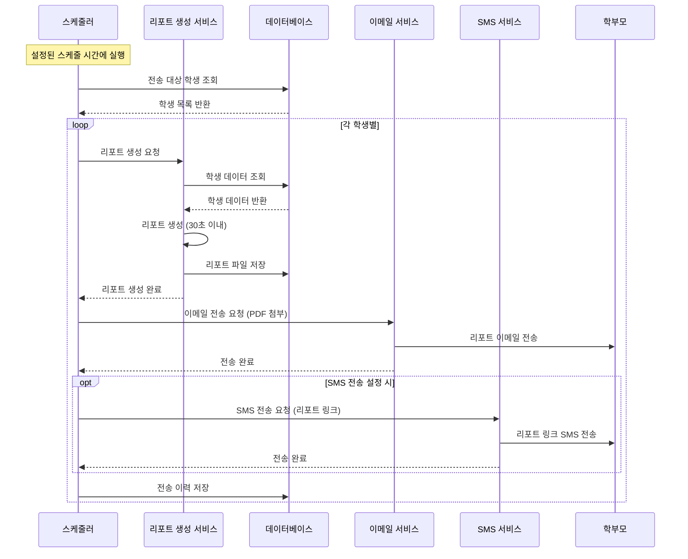
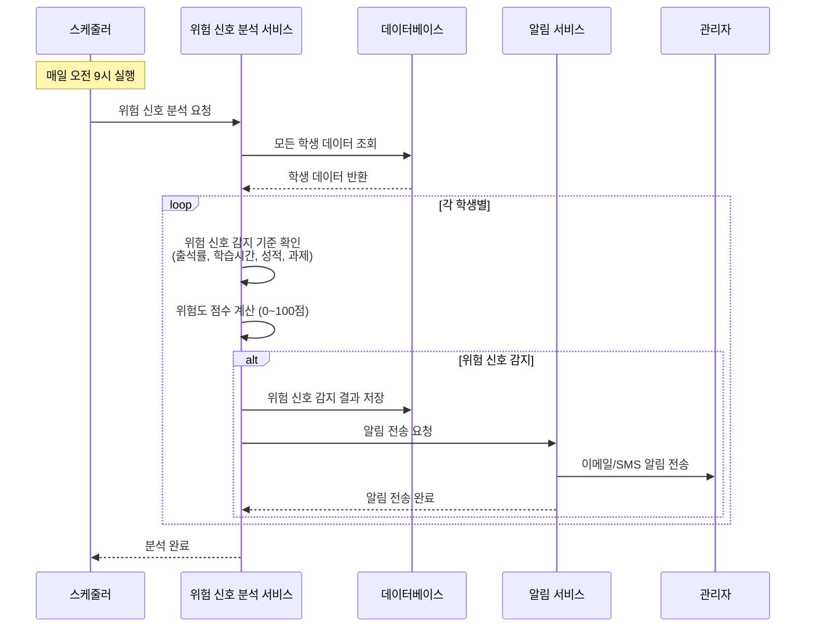
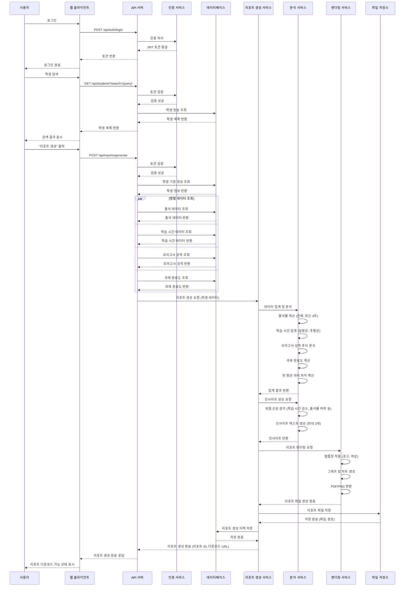

# Software Requirements Specification (SRS)

Document ID: SRS-001  
Revision: 1.0  
Date: 2025-11-22  
Standard: ISO/IEC/IEEE 29148:2018

---

## 1. Introduction

### 1.1 Purpose

본 문서는 도심형 통학 관리형 재수 학원을 위한 성과 리포트 자동화 SaaS 시스템의 소프트웨어 요구사항을 정의합니다. 본 SRS는 시스템의 기능 요구사항, 비기능 요구사항, 인터페이스 요구사항, 데이터 모델, 제약사항을 명시하여 개발팀, 테스트팀, 이해관계자 간의 공통 이해를 제공합니다.

본 문서는 다음 목적을 위해 사용됩니다:
- 시스템 개발을 위한 요구사항 명세
- 테스트 계획 및 테스트 케이스 작성의 기반
- 시스템 검증 및 확인의 기준
- 변경 관리 및 추적성 확보

### 1.2 Scope

#### In-Scope (MVP 범위)

본 SRS는 다음 기능을 포함하는 MVP(Minimum Viable Product) 범위를 정의합니다:

1. **학생별 종합 성과 리포트 즉시 생성 (F1)**
   - 학생 검색 및 리포트 생성
   - 출석률, 학습 시간, 모의고사 성적, 과제 완료도 통합 리포트
   - PDF/PNG 형식 리포트 생성 (30초 이내)
   - 자동 인사이트 생성 (최대 3개)

2. **다중 시스템 데이터 자동 통합 (F2)**
   - 출석 관리 앱, LMS, 모의고사 플랫폼, 결제 시스템 연동
   - API 연동 및 파일 업로드 지원
   - 데이터 통합 대시보드 제공
   - 데이터 불일치 자동 감지 및 알림

3. **학부모 정기 리포트 자동 전송 (F3)**
   - 스케줄 기반 리포트 자동 생성 및 전송
   - 이메일/SMS 전송 지원
   - 리포트 열람 여부 추적
   - 개인화 메시지 자동 생성

4. **학생별 위험 신호 자동 감지 및 알림 (F4)**
   - 출석률, 학습 시간, 성적, 과제 완료도 기반 위험 신호 감지
   - 위험도 점수 계산 (0~100점)
   - 자동 알림 전송 (이메일/SMS)
   - 주의 필요 학생 리스트 제공

5. **사용자 관리 및 권한 관리**
   - 원장/관리자, 학사 관리자, 운영 관리자 역할 구분
   - 역할 기반 접근 제어

6. **시스템 설정 및 커스터마이징**
   - 리포트 템플릿 기본 설정 (학원 로고, 색상)
   - 위험 신호 감지 기준 설정
   - 알림 수신자 설정

#### Out-of-Scope (Post-MVP)

다음 기능은 본 MVP 범위에 포함되지 않으며, 향후 릴리즈에서 검토됩니다:

1. **지점별/반별 성과 비교 대시보드 (F5)**
2. **경영 대시보드 (F6)**
3. **학습 활동과 성적 상관관계 분석 (F7)**
4. **리포트 템플릿 고급 커스터마이징 (F8)**
5. **모바일 앱 (학부모용) (F9)**
6. **다국어 지원**
7. **실시간 채팅/상담 기능**
8. **결제 시스템 직접 연동 (읽기 전용만 지원)**

### 1.2.3 Assumptions

본 시스템 개발 및 운영에 대한 다음과 같은 가정을 전제로 합니다:

#### 기술적 가정
- 외부 시스템(출석 앱, LMS, 모의고사 플랫폼)은 REST API 또는 파일 업로드 방식을 지원합니다.
- 클라우드 인프라 환경에서 운영되며, 인터넷 연결이 필수입니다.
- 이메일 서버(SMTP) 및 SMS 서버(API) 연동이 가능합니다.

#### 운영 환경 가정
- 학원은 최소 1시간마다 데이터 동기화가 가능한 네트워크 환경을 보유합니다.
- 외부 시스템의 API 가용성은 95% 이상입니다.
- 사용자는 최신 브라우저(Chrome, Edge, Safari 최신 2개 버전)를 사용합니다.

#### 데이터 가정
- 학생 데이터는 학원 내부 시스템에서 관리되며, 개인정보 보호 규정을 준수합니다.
- 외부 시스템의 데이터 형식은 CSV, Excel, 또는 표준 JSON 형식을 따릅니다.
- 학원당 최대 500명의 학생 데이터를 처리할 수 있습니다.

#### 사용자 가정
- 사용자(원장, 학사 관리자, 운영 관리자)는 기본적인 웹 브라우저 사용 능력을 보유합니다.
- 사용자는 엑셀, 구글 시트 등 기본적인 도구 사용 경험이 있습니다.
- 클릭 기반 메뉴 방식 인터페이스를 선호합니다.

### 1.3 Definitions, Acronyms, Abbreviations

| 용어 | 정의 |
|------|------|
| **SaaS** | Software as a Service, 클라우드 기반 소프트웨어 서비스 |
| **LMS** | Learning Management System, 학습 관리 시스템 |
| **API** | Application Programming Interface, 응용 프로그래밍 인터페이스 |
| **MVP** | Minimum Viable Product, 최소 기능 제품 |
| **NPS** | Net Promoter Score, 고객 추천 지수 |
| **MRR** | Monthly Recurring Revenue, 월간 반복 매출 |
| **JTBD** | Jobs To Be Done, 고객이 달성하려는 목표 |
| **AOS** | Automation of Status Quo, 기존 수동 작업의 자동화 |
| **DOS** | Differentiation of Service, 새로운 차별화 기능 |
| **출석률** | 전체 수업 일수 대비 출석 일수의 비율 (%) |
| **학습 시간** | LMS에서 기록된 일일 학습 시간 (시간 단위) |
| **모의고사 성적** | 모의고사 플랫폼에서 기록된 점수 (점수 단위) |
| **과제 완료도** | 전체 과제 대비 완료한 과제의 비율 (%) |
| **위험 신호** | 학생의 학습 상태 악화를 나타내는 지표 변화 |
| **위험도 점수** | 위험 신호의 심각도를 0~100점으로 표현한 점수 |
| **리포트** | 학생의 종합 성과를 시각화한 문서 (PDF/PNG 형식) |
| **데이터 불일치** | 여러 시스템 간 동일 학생의 데이터가 일치하지 않는 상태 |
| **통합 대시보드** | 여러 시스템의 데이터를 통합하여 표시하는 화면 |

### 1.4 References

| ID | 문서명 | 버전 | 위치 |
|----|--------|------|------|
| REF-01 | Product Requirements Document (PRD) | 1.1 | 30_prd/01_PRD_urban-repeaters.md |
| REF-02 | Vision and Product Strategy (VPS) | 1.1 | 20_vps/01_VPS_urban-repeaters.md |
| REF-03 | Porter 5 Forces Analysis | - | 10_analysis/10_porter-5-forces.md |
| REF-04 | Market Overview & TAM/SAM/SOM | - | 10_analysis/11_market-overview_TAM-SAM-SOM.md |
| REF-05 | ISO/IEC/IEEE 29148:2018 | 2018 | Systems and software engineering — Life cycle processes — Requirements engineering |

## 1.5 Assumptions & Constraints

### 1.5.1 Technical Constraints (기술적 제약)

C-TEC-001: 모든 프론트엔드 애플리케이션은 Vite 기반 React.js(React 18+)를 사용한다.  
C-TEC-002: 모든 백엔드 코어 서비스는 Java 17 + Spring Boot 3.x를 사용한다.  
C-TEC-003: 데이터베이스는 MySQL 8.x(엔진: InnoDB, 문자셋: utf8mb4)를 기본으로 한다.  
C-TEC-004: 문서 자동 생성 및 LLM 오케스트레이션 엔진은 Python 3.10+ 기반 FastAPI + LangChain으로 구현한다.  
C-TEC-005: 외부 LLM 요청은 사내 LLM Gateway를 통해 이루어지며, Providers는 Gemini API를 우선 사용한다(필요 시 OpenAI 등 fallback 가능).  
C-TEC-006: 시스템 간 통신은 REST API(OpenAPI 3.x)를 기본으로 하며, 내부 고성능 모듈에 한해 gRPC 사용을 허용한다.  
C-TEC-007: 모든 엔드포인트는 JWT 기반 인증/인가를 사용한다.  
C-TEC-008: 서비스 배포는 Docker 기반 컨테이너로 수행하며, 오케스트레이션은 Kubernetes(또는 관리형 K8s 서비스)를 사용한다.  
C-TEC-009: 로깅/모니터링은 OpenTelemetry 기반으로 통합하며, APM은 Grafana Stack 또는 Datadog을 이용한다.

### 1.5.2 External Constraints (외부 제약)

C-EXT-001: 모든 학사·출석·모의고사 원천 데이터는 기존 AMS 또는 CSV/Excel 업로드를 통해 제공된다고 가정한다.  
C-EXT-002: 기관별 리포트 템플릿은 학원 측에서 제공하며, 우리 시스템은 이를 자동 매핑·자동 생성하는 기능만 제공한다.  
C-EXT-003: 외부 API(AMS, 모의고사 업체 등)의 속도·가용성 저하는 우리 시스템 SLA 대상에서 제외된다.

### 1.5.3 Operational Assumptions (운영 전제)

C-OPR-001: 초기 배포 환경은 Cloud 환경(AWS/GCP)으로 가정한다.  
C-OPR-002: 학원은 최소 1명 이상의 담당자가 데이터 업로드·검토·승인을 수행한다고 가정한다.  
C-OPR-003: 학원별 리포트 스케줄(주간/월간)은 고객이 직접 설정하며, 우리 시스템은 설정값에 따라 자동 실행만 담당한다.
---

## 2. Stakeholders

| Role | Responsibility | Interest |
|------|---------------|----------|
| **원장/관리자** (김원장 페르소나) | 학원 전체 운영 관리, 전략적 의사결정, 재등록률 및 학부모 만족도 향상 | 리포트 제작 시간 절감 (주 5~6시간 → 주 1시간 이하), 데이터 기반 의사결정 지원, 재등록률 70%→85% 달성, 학부모 NPS 50→70 향상 |
| **학사 관리자** (박학사 페르소나) | 리포트 제작, 학부모 상담, 학생 관리, 반별 성적 관리 | 리포트 제작 시간 절감 (주 15시간 → 주 3시간 이하), 학생별 맞춤 관리 케이스 조기 발견, 리포트 오류 빈도 감소 |
| **운영 관리자** (이관리 페르소나) | 데이터 입력, 시스템 연동 관리, 리포트 원천 데이터 관리 | 데이터 입력 오류 최소화, 반복 작업 자동화, 시스템 간 데이터 동기화 |
| **학부모** | 학생 성과 리포트 수신 및 열람 | 정기적이고 일관된 리포트 수신, 자녀의 학습 상태 파악, 학원과의 신뢰 관계 구축 |
| **개발팀** | 시스템 개발 및 유지보수 | 명확한 요구사항 정의, 테스트 가능한 요구사항, 추적 가능한 요구사항 |
| **테스트팀** | 시스템 테스트 및 검증 | 테스트 가능한 요구사항, 명확한 Acceptance Criteria |
| **제품 관리자** | 제품 전략 및 로드맵 관리 | MVP 범위 명확화, 우선순위 관리, 고객 피드백 반영 |

---

## 3. System Context and Interfaces

### 3.1 External Systems

본 시스템은 다음 외부 시스템과 연동됩니다:

| 시스템명 | 연동 방식 | 데이터 유형 | 연동 주기 | 비고 |
|---------|----------|------------|----------|------|
| **출석 관리 앱** | REST API 또는 CSV/Excel 파일 | 학생 ID, 날짜, 출석 여부 | 최소 1시간마다 (API) 또는 수동 업로드 | 필수 연동 |
| **LMS (학습 관리 시스템)** | REST API 또는 CSV/Excel 파일 | 학생 ID, 날짜, 학습 시간, 과제 ID, 완료 여부 | 최소 1시간마다 (API) 또는 수동 업로드 | 필수 연동 |
| **모의고사 플랫폼** | REST API 또는 CSV/Excel 파일 | 학생 ID, 모의고사 회차, 성적 | 최소 1시간마다 (API) 또는 수동 업로드 | 필수 연동 |
| **결제 시스템** | REST API 또는 CSV/Excel 파일 | 학생 ID, 납부 여부 | 최소 1시간마다 (API) 또는 수동 업로드 | 선택 연동 |
| **이메일 서버** | SMTP/API | 리포트 PDF 첨부, 알림 메시지 | 실시간 전송 | 필수 |
| **SMS 서버** | API | 리포트 링크, 알림 메시지 | 실시간 전송 | 선택 |

### 3.2 Client Applications

| 클라이언트 유형 | 기술 스택 | 접근 방식 | 주요 기능 |
|---------------|----------|----------|----------|
| **웹 브라우저** | HTML5, CSS3, JavaScript | HTTPS | 모든 기능 접근 (리포트 생성, 데이터 통합, 스케줄 설정, 위험 신호 확인) |
| **모바일 웹** | 반응형 웹 디자인 | HTTPS | 리포트 조회, 위험 신호 확인 (제한적 기능) |

### 3.3 API Overview

본 시스템은 다음 API를 제공합니다:

1. **인증 및 권한 관리 API**
   - 사용자 로그인/로그아웃
   - 토큰 기반 인증
   - 역할 기반 접근 제어

2. **학생 관리 API**
   - 학생 목록 조회
   - 학생 검색
   - 학생 상세 정보 조회

3. **리포트 생성 API**
   - 리포트 생성 요청
   - 리포트 다운로드
   - 리포트 생성 이력 조회

4. **데이터 통합 API**
   - 외부 시스템 연동 설정
   - 데이터 동기화 요청
   - 데이터 불일치 조회

5. **스케줄 관리 API**
   - 리포트 전송 스케줄 설정
   - 스케줄 조회 및 수정
   - 전송 이력 조회

6. **위험 신호 관리 API**
   - 위험 신호 감지 기준 설정
   - 주의 필요 학생 리스트 조회
   - 위험 신호 이력 조회

상세 API 엔드포인트 목록은 부록 6.1을 참조하십시오.

### 3.4 Interaction Sequences

#### 3.4.1 핵심 시퀀스: 학생별 리포트 생성 (F1)



#### 3.4.2 핵심 시퀀스: 데이터 자동 통합 (F2)



#### 3.4.3 핵심 시퀀스: 정기 리포트 자동 전송 (F3)



#### 3.4.4 핵심 시퀀스: 위험 신호 자동 감지 및 알림 (F4)



---

## 4. Specific Requirements

### 4.1 Functional Requirements

| ID | Title | Description | Source | Priority | Acceptance Criteria | Verification | Status |
|----|-------|-------------|--------|----------|---------------------|--------------|--------|
| **REQ-FUNC-001** | 학생 검색 | 시스템은 학생 이름 또는 학생 ID로 학생을 검색할 수 있어야 한다. | F1 | High | Given: 학생 데이터가 존재할 때<br/>When: 사용자가 학생 이름 또는 ID를 입력하여 검색하면<br/>Then: 해당하는 학생 목록이 표시되어야 한다. 검색 결과는 최대 50명까지 표시되며, 페이지네이션을 지원해야 한다. | Test: 검색 기능 테스트, 부분 일치 검색 테스트 | Proposed |
| **REQ-FUNC-002** | 리포트 생성 요청 | 시스템은 사용자가 선택한 학생에 대해 리포트 생성을 요청받을 수 있어야 한다. | F1 | High | Given: 학생이 선택된 상태일 때<br/>When: 사용자가 "리포트 생성" 버튼을 클릭하면<br/>Then: 리포트 생성 프로세스가 시작되어야 하며, 진행 상태가 표시되어야 한다. | Test: 리포트 생성 요청 API 테스트 | Proposed |
| **REQ-FUNC-003** | 출석 데이터 조회 | 시스템은 리포트 생성 시 학생의 출석 데이터를 조회할 수 있어야 한다. | F1 | High | Given: 리포트 생성 요청이 있을 때<br/>When: 시스템이 출석 데이터를 조회하면<br/>Then: `attendance` 테이블에서 학생 ID로 출석 데이터를 조회하여 전체 기간 및 최근 4주 출석률을 계산할 수 있어야 한다. | Test: 출석 데이터 조회 테스트, 출석률 계산 로직 테스트 | Proposed |
| **REQ-FUNC-004** | 학습 시간 데이터 조회 | 시스템은 리포트 생성 시 학생의 학습 시간 데이터를 조회할 수 있어야 한다. | F1 | High | Given: 리포트 생성 요청이 있을 때<br/>When: 시스템이 학습 시간 데이터를 조회하면<br/>Then: `study_time` 테이블에서 학생 ID로 학습 시간 데이터를 조회하여 일평균, 주평균, 목표 대비 달성률을 계산할 수 있어야 한다. | Test: 학습 시간 데이터 조회 테스트, 집계 계산 테스트 | Proposed |
| **REQ-FUNC-005** | 모의고사 성적 데이터 조회 | 시스템은 리포트 생성 시 학생의 모의고사 성적 데이터를 조회할 수 있어야 한다. | F1 | High | Given: 리포트 생성 요청이 있을 때<br/>When: 시스템이 모의고사 성적 데이터를 조회하면<br/>Then: `mock_exam` 테이블에서 학생 ID로 최근 5회 모의고사 성적을 조회하여 추이 분석 및 등급 변화를 계산할 수 있어야 한다. | Test: 모의고사 성적 조회 테스트, 추이 분석 테스트 | Proposed |
| **REQ-FUNC-006** | 과제 완료도 데이터 조회 | 시스템은 리포트 생성 시 학생의 과제 완료도 데이터를 조회할 수 있어야 한다. | F1 | High | Given: 리포트 생성 요청이 있을 때<br/>When: 시스템이 과제 완료도 데이터를 조회하면<br/>Then: `assignments` 테이블에서 학생 ID로 과제 완료 데이터를 조회하여 완료율 및 미완료 과제 목록(최대 10개)을 계산할 수 있어야 한다. | Test: 과제 완료도 조회 테스트 | Proposed |
| **REQ-FUNC-007** | 반 평균 데이터 계산 | 시스템은 리포트 생성 시 학생이 속한 반의 평균 데이터를 계산할 수 있어야 한다. | F1 | High | Given: 리포트 생성 요청이 있을 때<br/>When: 시스템이 반 평균 데이터를 계산하면<br/>Then: 같은 반 학생들의 평균 출석률, 평균 학습 시간, 평균 모의고사 성적을 계산하여 학생과의 차이를 산출할 수 있어야 한다. | Test: 반 평균 계산 테스트 | Proposed |
| **REQ-FUNC-008** | 인사이트 자동 생성 | 시스템은 리포트 생성 시 학습 시간 감소, 출석률 하락, 성적 향상 등의 인사이트를 자동으로 생성할 수 있어야 한다. | F1 | High | Given: 리포트 생성 요청이 있을 때<br/>When: 시스템이 인사이트를 생성하면<br/>Then: 최대 3개의 인사이트 텍스트가 생성되어야 한다. 인사이트는 "최근 N주간 학습 시간이 목표 대비 X% 감소했습니다" 형식으로 생성되어야 한다. | Test: 인사이트 생성 로직 테스트 | Proposed |
| **REQ-FUNC-009** | 리포트 PDF 생성 | 시스템은 리포트를 PDF 형식으로 생성할 수 있어야 한다. | F1 | High | Given: 리포트 데이터가 준비된 상태일 때<br/>When: 시스템이 리포트를 PDF로 생성하면<br/>Then: A4 용지 기준의 PDF 파일이 생성되어야 하며, 학원 로고, 기본 정보, 그래프 및 차트가 포함되어야 한다. | Test: PDF 생성 테스트, 리포트 내용 검증 테스트 | Proposed |
| **REQ-FUNC-010** | 리포트 PNG 생성 | 시스템은 리포트를 PNG 이미지 형식으로 생성할 수 있어야 한다. | F1 | High | Given: 리포트 데이터가 준비된 상태일 때<br/>When: 시스템이 리포트를 PNG로 생성하면<br/>Then: A4 용지 기준의 PNG 이미지 파일이 생성되어야 하며, 리포트 내용이 시각적으로 표현되어야 한다. | Test: PNG 생성 테스트 | Proposed |
| **REQ-FUNC-011** | 리포트 생성 시간 제한 | 시스템은 리포트 생성이 30초를 초과하면 실패 처리해야 한다. | F1 | High | Given: 리포트 생성 요청이 있을 때<br/>When: 리포트 생성이 30초를 초과하면<br/>Then: 리포트 생성이 실패 처리되고 사용자에게 에러 메시지가 표시되어야 한다. | Test: 리포트 생성 시간 제한 테스트 | Proposed |
| **REQ-FUNC-012** | 리포트 다운로드 | 시스템은 생성된 리포트를 다운로드할 수 있도록 제공해야 한다. | F1 | High | Given: 리포트가 생성된 상태일 때<br/>When: 사용자가 리포트 다운로드를 요청하면<br/>Then: PDF 또는 PNG 형식의 리포트 파일이 다운로드되어야 한다. | Test: 리포트 다운로드 테스트 | Proposed |
| **REQ-FUNC-013** | 리포트 생성 이력 저장 | 시스템은 리포트 생성 이벤트를 로그로 저장해야 한다. | F1 | High | Given: 리포트 생성이 완료된 상태일 때<br/>When: 시스템이 리포트 생성 이력을 저장하면<br/>Then: 리포트 ID, 학생 ID, 생성 시간, 리포트 유형, 다운로드 여부가 저장되어야 한다. | Test: 리포트 생성 이력 저장 테스트 | Proposed |
| **REQ-FUNC-014** | 외부 시스템 API 연동 설정 | 시스템은 사용자가 외부 시스템(출석 앱, LMS, 모의고사 플랫폼)의 API 키를 입력하여 연동을 설정할 수 있어야 한다. | F2 | High | Given: 사용자가 시스템 연동 설정 페이지에 접근할 때<br/>When: 사용자가 API 키를 입력하고 저장하면<br/>Then: API 키가 암호화되어 저장되고, API 연동 테스트가 수행되어야 한다. 연동 성공 시 설정이 활성화되어야 한다. | Test: API 연동 설정 테스트, API 키 암호화 테스트 | Proposed |
| **REQ-FUNC-015** | 파일 업로드 데이터 수집 | 시스템은 사용자가 CSV/Excel 파일을 업로드하여 데이터를 수집할 수 있어야 한다. | F2 | High | Given: 사용자가 파일 업로드 페이지에 접근할 때<br/>When: 사용자가 CSV 또는 Excel 파일(최대 50MB)을 업로드하면<br/>Then: 파일이 파싱되어 데이터가 추출되고, 데이터 검증이 수행되어야 한다. 검증 실패 시 오류 항목이 표시되어야 한다. | Test: 파일 업로드 테스트, 파일 파싱 테스트, 데이터 검증 테스트 | Proposed |
| **REQ-FUNC-016** | 수동 데이터 입력 | 시스템은 사용자가 수동으로 데이터를 입력할 수 있는 인터페이스를 제공해야 한다. | F2 | High | Given: API 연동 및 파일 업로드가 불가능한 경우<br/>When: 사용자가 수동 입력 인터페이스를 통해 데이터를 입력하면<br/>Then: 데이터가 즉시 저장되고 검증되어야 한다. | Test: 수동 데이터 입력 테스트 | Proposed |
| **REQ-FUNC-017** | 데이터 자동 동기화 | 시스템은 API 연동이 설정된 외부 시스템에서 최소 1시간마다 자동으로 데이터를 동기화해야 한다. | F2 | High | Given: API 연동이 설정된 상태일 때<br/>When: 스케줄러가 1시간마다 데이터 동기화를 실행하면<br/>Then: 외부 시스템에서 최신 데이터를 가져와 저장해야 한다. 동기화 실패 시 최대 3회 재시도해야 하며, 재시도 간격은 최소 5분 이상이어야 한다. | Test: 데이터 자동 동기화 테스트, 재시도 로직 테스트 | Proposed |
| **REQ-FUNC-018** | 데이터 검증 | 시스템은 수집된 데이터의 형식 및 범위를 검증해야 한다. | F2 | High | Given: 데이터가 수집된 상태일 때<br/>When: 시스템이 데이터 검증을 수행하면<br/>Then: 필수 필드 존재 여부, 데이터 타입, 날짜 범위, 값 범위를 확인해야 한다. 검증 실패 시 오류 메시지가 표시되어야 한다. | Test: 데이터 검증 테스트 | Proposed |
| **REQ-FUNC-019** | 데이터 통합 | 시스템은 여러 외부 시스템에서 수집된 데이터를 학생 ID 기준으로 통합해야 한다. | F2 | High | Given: 여러 시스템에서 데이터가 수집된 상태일 때<br/>When: 시스템이 데이터 통합을 수행하면<br/>Then: 학생 ID를 기준으로 `attendance`, `study_time`, `mock_exam`, `payment` 테이블에 데이터가 저장되어야 한다. | Test: 데이터 통합 테스트 | Proposed |
| **REQ-FUNC-020** | 데이터 불일치 감지 | 시스템은 시스템 간 데이터 불일치를 자동으로 감지해야 한다. | F2 | High | Given: 여러 시스템에서 데이터가 통합된 상태일 때<br/>When: 시스템이 데이터 불일치를 감지하면<br/>Then: 불일치 데이터 목록이 생성되고, 관리자에게 이메일/SMS 알림이 전송되어야 한다. | Test: 데이터 불일치 감지 테스트 | Proposed |
| **REQ-FUNC-021** | 통합 대시보드 표시 | 시스템은 통합된 데이터를 대시보드 형태로 표시해야 한다. | F2 | High | Given: 데이터가 통합된 상태일 때<br/>When: 사용자가 통합 대시보드에 접근하면<br/>Then: 출석률(일별/주별/월별), 학습 시간(일별/주별/월별), 모의고사 성적(최신 성적, 추이 그래프), 결제 현황(미납 학생 목록), 데이터 최종 업데이트 시간이 표시되어야 한다. | Test: 통합 대시보드 표시 테스트 | Proposed |
| **REQ-FUNC-022** | 리포트 전송 스케줄 설정 | 시스템은 사용자가 리포트 전송 스케줄을 설정할 수 있어야 한다. | F3 | High | Given: 사용자가 리포트 전송 설정 페이지에 접근할 때<br/>When: 사용자가 전송 주기(주 1회/월 2회/월 1회), 전송 요일 및 시간, 전송 대상(전체/특정 반/특정 지점)을 설정하고 저장하면<br/>Then: 스케줄이 `report_schedule` 테이블에 저장되어야 한다. | Test: 리포트 전송 스케줄 설정 테스트 | Proposed |
| **REQ-FUNC-023** | 정기 리포트 자동 생성 | 시스템은 설정된 스케줄 시간에 자동으로 리포트를 생성해야 한다. | F3 | High | Given: 리포트 전송 스케줄이 설정된 상태일 때<br/>When: 스케줄 시간이 되면<br/>Then: 전송 대상 학생별로 리포트가 자동 생성되어야 한다. 리포트 생성 속도는 학생당 30초 이내여야 한다. | Test: 정기 리포트 자동 생성 테스트 | Proposed |
| **REQ-FUNC-024** | 개인화 메시지 생성 | 시스템은 리포트에 개인화된 메시지를 자동으로 포함해야 한다. | F3 | High | Given: 리포트가 생성된 상태일 때<br/>When: 시스템이 개인화 메시지를 생성하면<br/>Then: 학습 시간 목표 달성 여부, 출석률 목표 달성 여부를 확인하여 최대 2개의 개인화 메시지가 생성되어야 한다. | Test: 개인화 메시지 생성 테스트 | Proposed |
| **REQ-FUNC-025** | 리포트 이메일 전송 | 시스템은 생성된 리포트를 학부모 이메일 주소로 전송해야 한다. | F3 | High | Given: 리포트가 생성되고 학부모 이메일 주소가 있는 상태일 때<br/>When: 시스템이 리포트를 이메일로 전송하면<br/>Then: 리포트 PDF가 첨부된 이메일이 전송되어야 한다. 전송 실패 시 최대 3회 재시도해야 하며, 재시도 간격은 1시간 이상이어야 한다. | Test: 리포트 이메일 전송 테스트, 재시도 로직 테스트 | Proposed |
| **REQ-FUNC-026** | 리포트 SMS 전송 | 시스템은 생성된 리포트 링크를 SMS로 전송할 수 있어야 한다. | F3 | High | Given: 리포트가 생성되고 학부모 전화번호가 있는 상태일 때<br/>When: 사용자가 SMS 전송을 선택하면<br/>Then: 리포트 링크가 포함된 SMS가 전송되어야 한다. | Test: 리포트 SMS 전송 테스트 | Proposed |
| **REQ-FUNC-027** | 리포트 열람 여부 추적 | 시스템은 리포트 링크 클릭 시 열람 여부를 추적해야 한다. | F3 | High | Given: 리포트 링크가 전송된 상태일 때<br/>When: 학부모가 리포트 링크를 클릭하면<br/>Then: 열람 시간이 기록되어야 하며, 리포트 전송 내역에서 열람 여부를 확인할 수 있어야 한다. | Test: 리포트 열람 추적 테스트 | Proposed |
| **REQ-FUNC-028** | 리포트 전송 이력 저장 | 시스템은 리포트 전송 이력을 저장해야 한다. | F3 | High | Given: 리포트가 전송된 상태일 때<br/>When: 시스템이 리포트 전송 이력을 저장하면<br/>Then: 리포트 ID, 학생 ID, 학부모 이메일, 전송 시간, 전송 성공/실패 여부가 `report_delivery` 테이블에 저장되어야 한다. | Test: 리포트 전송 이력 저장 테스트 | Proposed |
| **REQ-FUNC-029** | 위험 신호 감지 기준 설정 | 시스템은 사용자가 위험 신호 감지 기준을 설정할 수 있어야 한다. | F4 | High | Given: 사용자가 위험 신호 설정 페이지에 접근할 때<br/>When: 사용자가 출석률 하락 임계값(20% 이상 하락 또는 주간 출석률 70% 이하), 학습 시간 감소 임계값(30% 이상 감소 또는 주간 학습 시간 목표 대비 50% 미만), 모의고사 성적 하락 임계값(최근 2회 평균 대비 10점 이상 하락), 과제 완료도 임계값(주간 과제 완료율 50% 미만)을 설정하고 저장하면<br/>Then: 설정이 저장되어야 한다. | Test: 위험 신호 감지 기준 설정 테스트 | Proposed |
| **REQ-FUNC-030** | 위험 신호 자동 분석 | 시스템은 매일 오전 9시에 모든 학생 데이터를 자동으로 분석하여 위험 신호를 감지해야 한다. | F4 | High | Given: 위험 신호 감지 기준이 설정된 상태일 때<br/>When: 매일 오전 9시에 스케줄러가 위험 신호 분석을 실행하면<br/>Then: 모든 학생의 출석률, 학습 시간, 모의고사 성적, 과제 완료도를 분석하여 위험 신호를 감지해야 한다. 분석 완료 시간은 학생 300명 기준 5분 이내여야 한다. | Test: 위험 신호 자동 분석 테스트, 성능 테스트 | Proposed |
| **REQ-FUNC-031** | 위험도 점수 계산 | 시스템은 감지된 위험 신호에 대해 위험도 점수(0~100점)를 계산해야 한다. | F4 | High | Given: 위험 신호가 감지된 상태일 때<br/>When: 시스템이 위험도 점수를 계산하면<br/>Then: 출석률 하락 30점, 학습 시간 감소 25점, 성적 하락 25점, 과제 완료도 저하 20점을 기준으로 점수를 계산해야 한다. 여러 위험 신호가 동시에 발생 시 점수는 누적되며 최대 100점이다. | Test: 위험도 점수 계산 테스트 | Proposed |
| **REQ-FUNC-032** | 위험 신호 감지 결과 저장 | 시스템은 위험 신호 감지 결과를 저장해야 한다. | F4 | High | Given: 위험 신호가 감지된 상태일 때<br/>When: 시스템이 위험 신호 감지 결과를 저장하면<br/>Then: 학생 ID, 감지 시간, 위험 신호 종류, 위험도 점수가 `risk_detection` 테이블에 저장되어야 한다. | Test: 위험 신호 감지 결과 저장 테스트 | Proposed |
| **REQ-FUNC-033** | 위험 신호 알림 전송 | 시스템은 위험 신호가 감지되면 즉시 알림을 전송해야 한다. | F4 | High | Given: 위험 신호가 감지된 상태일 때<br/>When: 시스템이 알림을 전송하면<br/>Then: 관리자 및 학사 관리자에게 이메일/SMS 알림이 전송되어야 한다. 알림 내용에는 학생 이름, 위험 신호 종류, 위험도 점수, 상세 정보 링크가 포함되어야 한다. 알림 전송 시간은 1분 이내여야 한다. | Test: 위험 신호 알림 전송 테스트 | Proposed |
| **REQ-FUNC-034** | 주의 필요 학생 리스트 표시 | 시스템은 위험도 점수 기준 내림차순으로 주의 필요 학생 리스트를 표시해야 한다. | F4 | High | Given: 위험 신호가 감지된 상태일 때<br/>When: 사용자가 주의 필요 학생 리스트 페이지에 접근하면<br/>Then: 위험도 점수 기준 내림차순으로 학생 목록이 표시되어야 하며, 학생별 위험 신호 상세 정보(어떤 지표에서 위험 신호가 감지되었는지, 전주 대비 변화율, 위험도 점수)가 표시되어야 한다. 리스트는 최대 50명까지 표시되며 페이지네이션을 지원해야 한다. | Test: 주의 필요 학생 리스트 표시 테스트 | Proposed |
| **REQ-FUNC-035** | 조치 기록 저장 | 시스템은 사용자가 위험 신호에 대한 조치 내역을 선택적으로 기록할 수 있어야 한다. | F4 | High | Given: 위험 신호가 감지된 상태일 때<br/>When: 사용자가 조치 내역을 입력하고 저장하면<br/>Then: 학생 ID, 위험 신호 ID, 조치 시간, 조치 내용, 조치자가 `risk_action` 테이블에 저장되어야 한다. | Test: 조치 기록 저장 테스트 | Proposed |
| **REQ-FUNC-036** | 사용자 인증 | 시스템은 사용자 로그인을 통해 인증을 수행해야 한다. | - | High | Given: 사용자가 로그인 페이지에 접근할 때<br/>When: 사용자가 이메일과 비밀번호를 입력하여 로그인하면<br/>Then: 인증이 성공하면 JWT 토큰이 발급되어야 하며, 인증이 실패하면 에러 메시지가 표시되어야 한다. | Test: 사용자 인증 테스트 | Proposed |
| **REQ-FUNC-037** | 역할 기반 접근 제어 | 시스템은 사용자 역할에 따라 기능 접근을 제어해야 한다. | 4.2 | High | Given: 사용자가 로그인된 상태일 때<br/>When: 사용자가 기능에 접근하려고 하면<br/>Then: 원장/관리자는 모든 기능에 접근할 수 있어야 하며, 학사 관리자는 리포트 생성, 학생 데이터 조회, 위험 신호 확인, 리포트 전송 설정에 접근할 수 있어야 하고, 운영 관리자는 데이터 입력, 시스템 연동 관리, 리포트 원천 데이터 관리에 접근할 수 있어야 한다. | Test: 역할 기반 접근 제어 테스트 | Proposed |
| **REQ-FUNC-038** | 리포트 템플릿 기본 설정 | 시스템은 사용자가 리포트 템플릿의 기본 설정(학원 로고, 색상)을 할 수 있어야 한다. | F3 | Medium | Given: 사용자가 리포트 템플릿 설정 페이지에 접근할 때<br/>When: 사용자가 학원 로고를 업로드하고 기본 색상(최대 3가지)을 선택하여 저장하면<br/>Then: 설정이 저장되어야 하며, 리포트 생성 시 자동으로 적용되어야 한다. | Test: 리포트 템플릿 설정 테스트 | Proposed |
| **REQ-FUNC-039** | 알림 수신자 설정 | 시스템은 사용자가 알림 수신자(관리자, 학사 관리자 이메일/SMS 번호)를 설정할 수 있어야 한다. | F4 | Medium | Given: 사용자가 알림 설정 페이지에 접근할 때<br/>When: 사용자가 알림 수신자 이메일/SMS 번호를 입력하고 저장하면<br/>Then: 설정이 저장되어야 하며, 위험 신호 감지 시 해당 수신자에게 알림이 전송되어야 한다. | Test: 알림 수신자 설정 테스트 | Proposed |
| **REQ-FUNC-040** | 데이터 불일치 수정 인터페이스 | 시스템은 사용자가 데이터 불일치를 수정할 수 있는 인터페이스를 제공해야 한다. | F2 | Medium | Given: 데이터 불일치가 감지된 상태일 때<br/>When: 사용자가 불일치 데이터 목록에서 항목을 선택하고 수정하면<br/>Then: 데이터가 수정되어야 하며, 불일치 상태가 해제되어야 한다. | Test: 데이터 불일치 수정 테스트 | Proposed |

### 4.2 Non-Functional Requirements

| ID | Category | Description (Measurable) | Acceptance Criteria | Verification |
|----|----------|-------------------------|---------------------|--------------|
| **REQ-NF-001** | Performance | 리포트 생성 성능: 리포트 생성 시작 후 30초 이내 완료 | 리포트 생성 버튼 클릭 후 30초 이내에 리포트가 생성되어야 한다. 동시 생성 요청 10건 처리 시 평균 응답 시간 30초 이내 유지. | 성능 테스트: 리포트 생성 시간 측정, 부하 테스트 |
| **REQ-NF-002** | Performance | 데이터 통합 성능: 시스템당 평균 2분 이내 데이터 통합 완료 | 외부 시스템에서 데이터를 가져와 통합하는 데 시스템당 평균 2분 이내가 소요되어야 한다. | 성능 테스트: 데이터 통합 시간 측정 |
| **REQ-NF-003** | Performance | 위험 신호 분석 성능: 학생 300명 기준 5분 이내 분석 완료 | 매일 오전 9시 실행되는 위험 신호 분석이 학생 300명 기준 5분 이내에 완료되어야 한다. | 성능 테스트: 위험 신호 분석 시간 측정 |
| **REQ-NF-004** | Performance | 동시 리포트 생성 처리: 최대 10건 동시 처리 | 리포트 생성 요청이 동시에 10건 이상 발생하면 초과 요청은 대기열에 추가되어야 한다. | 부하 테스트: 동시 리포트 생성 처리 테스트 |
| **REQ-NF-005** | Performance | API 응답 시간: 평균 500ms 이내 | API 엔드포인트의 평균 응답 시간이 500ms 이내여야 한다. (리포트 생성 제외) | 성능 테스트: API 응답 시간 측정 |
| **REQ-NF-006** | Reliability | 시스템 가동률: 99% 이상 | 시스템은 연간 가동률 99% 이상을 유지해야 한다. (계획된 유지보수 시간 제외) | 모니터링: 시스템 가동률 측정 |
| **REQ-NF-007** | Reliability | 데이터 통합 정확도: 99% 이상 | 실제 데이터 대비 통합 데이터 일치율이 99% 이상이어야 한다. | 데이터 정확도 테스트: 샘플 데이터 검증 |
| **REQ-NF-008** | Reliability | 리포트 생성 성공률: 95% 이상 | 리포트 생성 요청 중 95% 이상이 성공적으로 완료되어야 한다. | 모니터링: 리포트 생성 성공률 측정 |
| **REQ-NF-009** | Reliability | API 연동 재시도: 최대 3회, 재시도 간격 최소 5분 | API 연동 실패 시 최대 3회까지 재시도하며, 재시도 간격은 최소 5분 이상이어야 한다. | 재시도 로직 테스트 |
| **REQ-NF-010** | Reliability | 리포트 전송 재시도: 최대 3회, 재시도 간격 1시간 | 리포트 전송 실패 시 최대 3회까지 재시도하며, 재시도 간격은 1시간 이상이어야 한다. | 재시도 로직 테스트 |
| **REQ-NF-011** | Scalability | 동시 사용자 지원: 최대 100명 | 시스템은 최대 100명의 동시 사용자를 지원해야 한다. | 부하 테스트: 동시 사용자 테스트 |
| **REQ-NF-012** | Scalability | 학생 데이터 지원: 학원당 최대 500명 | 시스템은 학원당 최대 500명의 학생 데이터를 지원해야 한다. | 확장성 테스트 |
| **REQ-NF-013** | Security | 데이터 암호화: API 키 및 비밀번호 암호화 저장 | API 키 및 사용자 비밀번호는 암호화되어 저장되어야 한다. | 보안 테스트: 암호화 검증 |
| **REQ-NF-014** | Security | 인증 토큰 유효기간: 24시간 | JWT 토큰의 유효기간은 24시간이며, 만료 시 재로그인이 필요하다. | 보안 테스트: 토큰 만료 테스트 |
| **REQ-NF-015** | Security | HTTPS 통신: 모든 통신은 HTTPS 사용 | 웹 클라이언트와 API 서버 간 모든 통신은 HTTPS를 사용해야 한다. | 보안 테스트: HTTPS 통신 검증 |
| **REQ-NF-016** | Security | 개인정보 보호: 학생 및 학부모 개인정보 암호화 저장 | 학생 및 학부모의 개인정보(이름, 이메일, 전화번호)는 암호화되어 저장되어야 한다. | 보안 테스트: 개인정보 암호화 검증 |
| **REQ-NF-017** | Usability | 사용자 가이드: 온라인 도움말 제공 | 시스템은 주요 기능에 대한 온라인 도움말을 제공해야 한다. | 사용성 테스트: 도움말 접근성 테스트 |
| **REQ-NF-018** | Usability | 에러 메시지: 명확하고 이해하기 쉬운 에러 메시지 | 시스템은 에러 발생 시 명확하고 이해하기 쉬운 에러 메시지를 표시해야 한다. | 사용성 테스트: 에러 메시지 검증 |
| **REQ-NF-019** | Usability | 반응형 웹 디자인: 모바일 기기 지원 | 웹 인터페이스는 모바일 기기에서도 사용 가능하도록 반응형 디자인을 적용해야 한다. | 사용성 테스트: 모바일 호환성 테스트 |
| **REQ-NF-020** | Maintainability | 로깅: 모든 주요 이벤트 로깅 | 시스템은 리포트 생성, 데이터 동기화, 위험 신호 감지 등 모든 주요 이벤트를 로깅해야 한다. | 로깅 검증 테스트 |
| **REQ-NF-021** | Maintainability | 모니터링: 시스템 상태 모니터링 | 시스템은 CPU, 메모리, 디스크 사용률, API 응답 시간 등을 모니터링해야 한다. | 모니터링 시스템 검증 |
| **REQ-NF-022** | Compatibility | 브라우저 지원: Chrome, Edge, Safari 최신 2개 버전 | 웹 인터페이스는 Chrome, Edge, Safari의 최신 2개 버전을 지원해야 한다. | 호환성 테스트: 브라우저 테스트 |
| **REQ-NF-023** | Compatibility | 파일 형식 지원: CSV, Excel (.xlsx, .xls) | 파일 업로드 기능은 CSV, Excel (.xlsx, .xls) 형식을 지원해야 한다. | 호환성 테스트: 파일 형식 테스트 |
| **REQ-NF-024** | Constraints | 파일 업로드 크기 제한: 최대 50MB | 파일 업로드 시 최대 50MB까지 지원해야 한다. | 제약사항 검증 테스트 |
| **REQ-NF-025** | Constraints | 리포트 생성 대상 제한: 한 번에 최대 100명 | 리포트 생성 요청 시 한 번에 최대 100명까지 처리할 수 있어야 한다. | 제약사항 검증 테스트 |
| **REQ-NF-026** | Constraints | 위험 신호 분석 대상 제한: 한 번에 최대 500명 | 위험 신호 분석 시 한 번에 최대 500명까지 처리할 수 있어야 한다. | 제약사항 검증 테스트 |
| **REQ-NF-027** | Constraints | 스케줄 실행 최소 간격: 1시간 | 정기 리포트 자동 전송, 위험 신호 분석, 데이터 동기화의 스케줄 실행 최소 간격은 1시간이어야 한다. | 제약사항 검증 테스트 |
| **REQ-NF-028** | Constraints | 실행 시간 제한: 리포트 생성 30초, 데이터 동기화 2분, 위험 신호 분석 5분 | 리포트 생성은 30초, 데이터 동기화는 시스템당 2분, 위험 신호 분석은 학생 300명 기준 5분을 초과하면 실패 처리해야 한다. | 제약사항 검증 테스트 |
| **REQ-NF-029** | Business Impact | 리포트 제작 시간 절감: 93% 이상 | 리포트 제작 시간이 주 15시간에서 주 1시간 이하로 단축되어야 한다. (93% 이상 절감) | 비즈니스 KPI 측정: 리포트 제작 시간 추적 |
| **REQ-NF-030** | Business Impact | 데이터 통합 시간 절감: 90% 이상 | 데이터 통합 시간이 주 5시간에서 주 30분 이하로 단축되어야 한다. (90% 이상 절감) | 비즈니스 KPI 측정: 데이터 통합 시간 추적 |
| **REQ-NF-031** | Business Impact | 학부모 만족도(NPS) 향상: 50 → 65 이상 | 학부모 만족도(NPS)가 50에서 65 이상으로 향상되어야 한다. | 비즈니스 KPI 측정: NPS 설문조사 |
| **REQ-NF-032** | Business Impact | 재등록률 향상: 70% → 75% 이상 | 재등록률이 70%에서 75% 이상으로 향상되어야 한다. | 비즈니스 KPI 측정: 재등록률 추적 |
| **REQ-NF-033** | Business Impact | 리포트 생성 속도 달성률: 95% 이상 | 학생별 리포트 생성 속도 30초 이내 달성률이 95% 이상이어야 한다. | 성능 모니터링: 리포트 생성 시간 분포 분석 |
| **REQ-NF-034** | Business Impact | 리포트 정확도 향상: 85% → 99% 이상 | 리포트 정확도가 85%에서 99% 이상으로 향상되어야 한다. | 데이터 정확도 테스트: 리포트 내용 검증 |

---

## 5. Traceability Matrix

| Story/Feature | Requirement ID | Test Case ID | Status |
|---------------|----------------|--------------|--------|
| **F1: 학생별 종합 성과 리포트 즉시 생성** | REQ-FUNC-001 ~ REQ-FUNC-013 | TC-F1-001 ~ TC-F1-013 | Proposed |
| **F2: 다중 시스템 데이터 자동 통합** | REQ-FUNC-014 ~ REQ-FUNC-021, REQ-FUNC-040 | TC-F2-001 ~ TC-F2-008 | Proposed |
| **F3: 학부모 정기 리포트 자동 전송** | REQ-FUNC-022 ~ REQ-FUNC-028, REQ-FUNC-038 | TC-F3-001 ~ TC-F3-007 | Proposed |
| **F4: 학생별 위험 신호 자동 감지 및 알림** | REQ-FUNC-029 ~ REQ-FUNC-035, REQ-FUNC-039 | TC-F4-001 ~ TC-F4-007 | Proposed |
| **사용자 인증 및 권한 관리** | REQ-FUNC-036 ~ REQ-FUNC-037 | TC-AUTH-001 ~ TC-AUTH-002 | Proposed |
| **학부모 상담 시 30초 이내 리포트 생성** | REQ-NF-001 | TC-PERF-001 | Proposed |
| **리포트 생성 성공률 95% 이상** | REQ-NF-008 | TC-PERF-002 | Proposed |
| **데이터 통합 정확도 99% 이상** | REQ-NF-007 | TC-RELI-001 | Proposed |
| **시스템 가동률 99% 이상** | REQ-NF-006 | TC-RELI-002 | Proposed |
| **문제 학생 조기 발견** | REQ-FUNC-030 ~ REQ-FUNC-034 | TC-F4-002 ~ TC-F4-006 | Proposed |
| **리포트 제작 시간 절감 (93% 이상)** | REQ-NF-029 | TC-BIZ-001 | Proposed |
| **데이터 통합 시간 절감 (90% 이상)** | REQ-NF-030 | TC-BIZ-002 | Proposed |
| **학부모 만족도(NPS) 향상 (50→65)** | REQ-NF-031 | TC-BIZ-003 | Proposed |
| **재등록률 향상 (70%→75%)** | REQ-NF-032 | TC-BIZ-004 | Proposed |
| **리포트 생성 속도 달성률 (95% 이상)** | REQ-NF-033 | TC-PERF-003 | Proposed |
| **리포트 정확도 향상 (85%→99%)** | REQ-NF-034 | TC-RELI-003 | Proposed |

---

## 6. Appendix

### 6.1 API Endpoint List

| Method | Endpoint | Description | Request Body | Response | Authentication |
|--------|----------|-------------|--------------|----------|---------------|
| **POST** | `/api/auth/login` | 사용자 로그인 | `{ "email": string, "password": string }` | `{ "token": string, "user": object }` | None |
| **POST** | `/api/auth/logout` | 사용자 로그아웃 | - | `{ "message": string }` | Required |
| **GET** | `/api/students` | 학생 목록 조회 | Query: `?search={query}&page={page}&limit={limit}` | `{ "students": array, "total": number, "page": number }` | Required |
| **GET** | `/api/students/{studentId}` | 학생 상세 정보 조회 | - | `{ "student": object }` | Required |
| **POST** | `/api/reports/generate` | 리포트 생성 요청 | `{ "studentId": string, "format": "pdf" \| "png" }` | `{ "reportId": string, "downloadUrl": string }` | Required |
| **GET** | `/api/reports/{reportId}/download` | 리포트 다운로드 | - | File (PDF/PNG) | Required |
| **GET** | `/api/reports/history` | 리포트 생성 이력 조회 | Query: `?studentId={id}&page={page}&limit={limit}` | `{ "reports": array, "total": number }` | Required |
| **POST** | `/api/integrations/setup` | 외부 시스템 연동 설정 | `{ "systemType": string, "apiKey": string, "config": object }` | `{ "integrationId": string, "status": string }` | Required (Admin) |
| **POST** | `/api/integrations/upload` | 파일 업로드 데이터 수집 | FormData: `{ "file": File, "systemType": string }` | `{ "uploadId": string, "status": string, "errors": array }` | Required |
| **POST** | `/api/integrations/sync` | 데이터 동기화 요청 | `{ "systemType": string }` | `{ "syncId": string, "status": string }` | Required (Admin) |
| **GET** | `/api/integrations/dashboard` | 통합 대시보드 데이터 조회 | Query: `?period={daily\|weekly\|monthly}` | `{ "attendance": object, "studyTime": object, "mockExam": object, "payment": object }` | Required |
| **GET** | `/api/integrations/discrepancies` | 데이터 불일치 조회 | Query: `?page={page}&limit={limit}` | `{ "discrepancies": array, "total": number }` | Required |
| **POST** | `/api/integrations/discrepancies/{id}/resolve` | 데이터 불일치 수정 | `{ "correctedData": object }` | `{ "status": string }` | Required |
| **POST** | `/api/schedules/report` | 리포트 전송 스케줄 설정 | `{ "frequency": string, "dayOfWeek": number, "time": string, "target": object }` | `{ "scheduleId": string }` | Required (Admin/Academic) |
| **GET** | `/api/schedules/report` | 리포트 전송 스케줄 조회 | - | `{ "schedule": object }` | Required |
| **GET** | `/api/schedules/report/history` | 리포트 전송 이력 조회 | Query: `?studentId={id}&page={page}&limit={limit}` | `{ "deliveries": array, "total": number }` | Required |
| **POST** | `/api/risk/settings` | 위험 신호 감지 기준 설정 | `{ "attendanceThreshold": number, "studyTimeThreshold": number, "gradeThreshold": number, "assignmentThreshold": number }` | `{ "settingsId": string }` | Required (Admin) |
| **GET** | `/api/risk/students` | 주의 필요 학생 리스트 조회 | Query: `?page={page}&limit={limit}` | `{ "students": array, "total": number }` | Required |
| **GET** | `/api/risk/students/{studentId}` | 학생 위험 신호 상세 조회 | - | `{ "riskSignals": array, "riskScore": number }` | Required |
| **POST** | `/api/risk/actions` | 위험 신호 조치 기록 | `{ "studentId": string, "riskSignalId": string, "action": string }` | `{ "actionId": string }` | Required |
| **GET** | `/api/risk/history` | 위험 신호 이력 조회 | Query: `?studentId={id}&page={page}&limit={limit}` | `{ "history": array, "total": number }` | Required |
| **POST** | `/api/settings/template` | 리포트 템플릿 설정 | `{ "logo": File, "colors": array }` | `{ "settingsId": string }` | Required (Admin) |
| **POST** | `/api/settings/notifications` | 알림 수신자 설정 | `{ "recipients": array }` | `{ "settingsId": string }` | Required (Admin) |

### 6.2 Entity & Data Model

#### 6.2.1 주요 엔터티

**students (학생)**
- `student_id` (PK, UUID): 학생 고유 ID
- `name` (String, 암호화): 학생 이름
- `class_id` (FK): 반 ID
- `branch_id` (FK): 지점 ID
- `parent_email` (String, 암호화): 학부모 이메일
- `parent_phone` (String, 암호화): 학부모 전화번호
- `created_at` (Timestamp): 생성 시간
- `updated_at` (Timestamp): 수정 시간

**attendance (출석)**
- `attendance_id` (PK, UUID): 출석 기록 ID
- `student_id` (FK): 학생 ID
- `date` (Date): 출석 날짜
- `is_present` (Boolean): 출석 여부
- `source_system` (String): 데이터 출처 시스템
- `created_at` (Timestamp): 생성 시간

**study_time (학습 시간)**
- `study_time_id` (PK, UUID): 학습 시간 기록 ID
- `student_id` (FK): 학생 ID
- `date` (Date): 학습 날짜
- `hours` (Decimal): 학습 시간 (시간 단위)
- `source_system` (String): 데이터 출처 시스템
- `created_at` (Timestamp): 생성 시간

**mock_exam (모의고사 성적)**
- `mock_exam_id` (PK, UUID): 모의고사 기록 ID
- `student_id` (FK): 학생 ID
- `exam_round` (Integer): 모의고사 회차
- `score` (Integer): 성적 (점수)
- `grade` (String): 등급
- `exam_date` (Date): 시험 날짜
- `source_system` (String): 데이터 출처 시스템
- `created_at` (Timestamp): 생성 시간

**assignments (과제)**
- `assignment_id` (PK, UUID): 과제 기록 ID
- `student_id` (FK): 학생 ID
- `assignment_name` (String): 과제명
- `is_completed` (Boolean): 완료 여부
- `due_date` (Date): 제출 기한
- `source_system` (String): 데이터 출처 시스템
- `created_at` (Timestamp): 생성 시간

**reports (리포트)**
- `report_id` (PK, UUID): 리포트 ID
- `student_id` (FK): 학생 ID
- `report_type` (String): 리포트 유형
- `format` (String): 리포트 형식 (PDF/PNG)
- `file_path` (String): 리포트 파일 경로
- `generated_at` (Timestamp): 생성 시간
- `downloaded_at` (Timestamp): 다운로드 시간
- `created_by` (FK): 생성자 ID

**report_schedule (리포트 전송 스케줄)**
- `schedule_id` (PK, UUID): 스케줄 ID
- `frequency` (String): 전송 주기 (weekly/monthly)
- `day_of_week` (Integer): 전송 요일 (0-6)
- `time` (Time): 전송 시간
- `target_type` (String): 전송 대상 유형 (all/class/branch)
- `target_ids` (JSON): 전송 대상 ID 목록
- `is_active` (Boolean): 활성화 여부
- `created_at` (Timestamp): 생성 시간

**report_delivery (리포트 전송 이력)**
- `delivery_id` (PK, UUID): 전송 이력 ID
- `report_id` (FK): 리포트 ID
- `student_id` (FK): 학생 ID
- `parent_email` (String): 학부모 이메일
- `sent_at` (Timestamp): 전송 시간
- `delivery_status` (String): 전송 상태 (success/failed)
- `opened_at` (Timestamp): 열람 시간
- `retry_count` (Integer): 재시도 횟수

**risk_detection (위험 신호 감지)**
- `risk_id` (PK, UUID): 위험 신호 ID
- `student_id` (FK): 학생 ID
- `detected_at` (Timestamp): 감지 시간
- `risk_type` (String): 위험 신호 종류
- `risk_score` (Integer): 위험도 점수 (0-100)
- `details` (JSON): 상세 정보
- `threshold_used` (JSON): 사용된 임계값

**risk_alert (위험 신호 알림)**
- `alert_id` (PK, UUID): 알림 ID
- `risk_id` (FK): 위험 신호 ID
- `student_id` (FK): 학생 ID
- `sent_at` (Timestamp): 전송 시간
- `recipient` (String): 수신자
- `alert_type` (String): 알림 유형 (email/sms)
- `alert_content` (String): 알림 내용

**risk_action (위험 신호 조치)**
- `action_id` (PK, UUID): 조치 ID
- `risk_id` (FK): 위험 신호 ID
- `student_id` (FK): 학생 ID
- `action_taken` (String): 조치 내용
- `taken_at` (Timestamp): 조치 시간
- `taken_by` (FK): 조치자 ID

**integrations (시스템 연동)**
- `integration_id` (PK, UUID): 연동 ID
- `system_type` (String): 시스템 유형 (attendance/lms/mock_exam/payment)
- `api_key` (String, 암호화): API 키
- `config` (JSON): 연동 설정
- `sync_frequency` (Integer): 동기화 주기 (분 단위)
- `last_sync_at` (Timestamp): 마지막 동기화 시간
- `sync_status` (String): 동기화 상태
- `is_active` (Boolean): 활성화 여부

**data_discrepancies (데이터 불일치)**
- `discrepancy_id` (PK, UUID): 불일치 ID
- `student_id` (FK): 학생 ID
- `system_a` (String): 시스템 A
- `system_b` (String): 시스템 B
- `data_field` (String): 불일치 데이터 필드
- `value_a` (String): 시스템 A 값
- `value_b` (String): 시스템 B 값
- `detected_at` (Timestamp): 감지 시간
- `resolved_at` (Timestamp): 해결 시간
- `resolved_by` (FK): 해결자 ID

### 6.3 Detailed Interaction Models (Sequence Diagrams)

#### 6.3.1 상세 시퀀스: 리포트 생성 전체 프로세스



#### 6.3.2 상세 시퀀스: 데이터 불일치 감지 및 처리

```mermaid
sequenceDiagram
    participant Scheduler as 스케줄러
    participant Integration as 데이터 통합 서비스
    participant ExternalA as 외부 시스템 A<br/>(출석 앱)
    participant ExternalB as 외부 시스템 B<br/>(LMS)
    participant DB as 데이터베이스
    participant Detection as 불일치 감지 서비스
    participant Alert as 알림 서비스
    participant Admin as 관리자

    Note over Scheduler: 매 1시간마다 실행
    Scheduler->>Integration: 데이터 동기화 요청
    
    par 병렬 데이터 수집
        Integration->>ExternalA: API 호출 (출석 데이터)
        ExternalA-->>Integration: 출석 데이터 반환
    and
        Integration->>ExternalB: API 호출 (학습 시간 데이터)
        ExternalB-->>Integration: 학습 시간 데이터 반환
    end
    
    Integration->>Integration: 데이터 검증 (형식, 범위)
    alt 검증 실패
        Integration->>Integration: 오류 로깅
        Integration-->>Scheduler: 동기화 실패
    else 검증 성공
        Integration->>DB: 데이터 저장
        DB-->>Integration: 저장 완료
        
        Integration->>Detection: 데이터 불일치 감지 요청
        Detection->>DB: 학생별 데이터 조회 (시스템 A, B)
        DB-->>Detection: 데이터 반환
        
        Detection->>Detection: 불일치 확인<br/>(예: 출석 앱에는 출석했으나<br/>LMS에 학습 기록 없음)
        
        alt 불일치 발견
            Detection->>DB: 불일치 데이터 저장
            DB-->>Detection: 저장 완료
            
            Detection->>Alert: 불일치 알림 요청
            Alert->>Alert: 관리자 이메일/SMS 작성
            Alert->>Admin: 알림 전송
            Alert-->>Detection: 알림 전송 완료
            
            Detection-->>Integration: 불일치 감지 완료
        else 불일치 없음
            Detection-->>Integration: 불일치 없음
        end
        
        Integration-->>Scheduler: 동기화 완료
    end